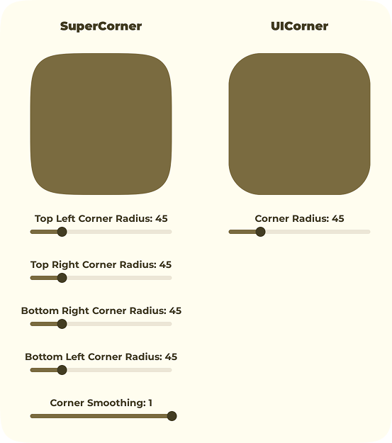

# SuperCorner

A Figma-inspired UICorner alternative for Roblox.

Benefits to SuperCorner:
- Supports individual corner radii.
- Supports corner smoothing (squircles).

## Disclaimer

> This library is not an official product from the Figma team and does not guarantee to produce the same results as you would get in Figma.

> This is a Roblox/Luau fork of [phamfoo/figma-squircle](https://github.com/phamfoo/figma-squircle) - Big thanks to the original creator.



## Usage

```luau
local Supercorner = require(path.to.Supercorner)

local Squircle = Supercorner.new({
	CornerRadius = 24,
	CornerSmoothing = 0.6,
})

local ImageLabel = Instance.new("ImageLabel")
ImageLabel.ImageContent = Squircle:GetContent()
ImageLabel.ScaleType = Enum.ScaleType.Slice
ImageLabel.Size = UDim2.fromOffset(200, 200)
ImageLabel.BackgroundTransparency = 1
ImageLabel.Parent = SomeParent

-- Update corners later
Squircle:Redraw({
	CornerRadius = 32,
	CornerSmoothing = 0.8,
	TopLeftCornerRadius = 16,
	TopRightCornerRadius = 16,
})
ImageLabel.ImageContent = Squircle:GetContent()

-- Clean up when done
Squircle:Destroy()
```
